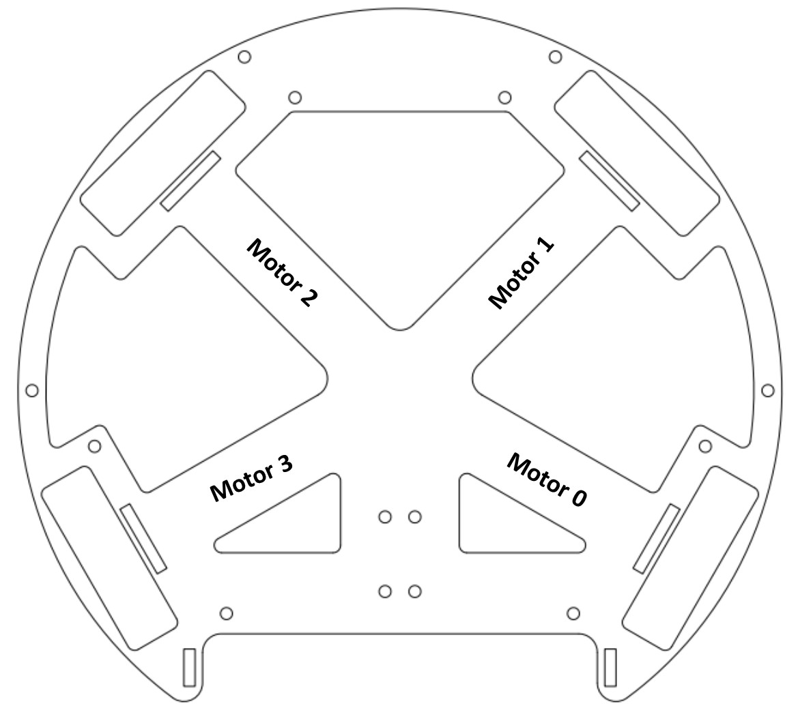
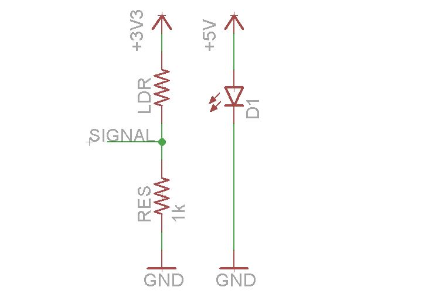

#### Documentation written by Cooper Richmond

-----

*Please Refer To The Documentation When Assembling The Robot*

------

# Motors

#### Maxon DCX19 + 21:1 19mm Gear Box

4 motors arranged at 60 degrees, 135 degrees, 225 degrees and 300 degrees.

**Table of Motor Positions**

|  Motor 0   |   Motor 1   |   Motor 2   |   Motor 3   |
| :--------: | :---------: | :---------: | :---------: |
| 60 degrees | 135 degrees | 225 degrees | 300 degrees |

This can be seen in the diagram below:

------

# Solenoid

##### Takaha Kiko CB1037

The solenoid used on the 2017 robot was a Takaha Kiko CB1037 open frame push solenoid. This solenoid is powered at 50V through the use of a voltage pump (found on Ebay, of course) and a charging circuit. This circuit stores 2000uf of charge at 50V for each kick. The original setup can be seen below:

Unfortunately, the firing setup for this charging circuit did not work, and a fix is still being investigated.

On the end of the solenoid, a 15mm x 3mm Carbon Fibre strip is used as a kicking surface. The strip is joined to two carbon fibre rods to prevent the kicker plate from rotating during gameplay. These rods slide through a guide mounted over the solenoid. This whole assembly is bolted directly between the lower and middle plate to prevent movement and increase the rigidity of the entire structure.

------

# Structure

The robots structure is based around 3 main plates, being the lower bottom plate, the middle plate and the main PCB. These 3 surfaces combine to create a rigid body that is resistant to twist and bending, allowing the robot to easily accelerate quickly and accurately.

The lower plate is home to the light sensor PCB, voltage booster circuit, solenoid charging circuit, solenoid, motors and battery. The middle plate is used to provide support for the motors and solenoid mounts, whilst also separating the major mechanical components from the main electrical components, such as the main PCB. This system allows the robot to be easily disassembled, whilst allowing the software team to continue work whilst a hardware issue is resolved. The main PCB is home to most of the electrical systems on board the robot.

***Insert Pic of Lower Assembly** - Without Motors, etc (assembled in box)*

After the first robot was assembled, it was discovered that the initial plates would not be appropriate for use on the robot after a number of plate breakage occurred at relatively low speeds. The initial design used brittle acrylic, as that was only opaque material our robotics laser cutting contact could supply. After some testing, the decision was made for the middle plate to be converted to a 1.6mm Laser Cut Aluminum plate to increase strength in such a vital part of the robot. Further testing will follow after the arrival of the new plates, to decide whether the bottom plate should also be converted to 1.6mm Aluminum. At the current time, the robot weighs only 1.2kg, with a max weight limit for the league of 2.5kg.

As can also be seen in the above image, the motor mounts are slotted in between the two plates to provide an easy, yet strong mounting method. This same setup is also used for the light gate on the front of the robot. We are yet to experience any issue with this system.

------

# Wheels

#### GTF Robots 50mm Diameter - 4mm Bore

The GTF Robots wheels have been used by our team for three years now. These wheels have been reliable and have met our expectations every year. Due to the predicted high speeds our robot may reach in 2017, a modification to these wheels was developed in case the wheels started to lack in the grip we require to compete at the highest level. The 18 rollers on each wheel will most likely be replaced with 18 spikes (aka rollers with spikes instead of a rubber o-ring). These spikes will allow the wheels to dig into the field and hopefully increase the available grip for the wheels. This will hopefully allow the robot to achieve speeds in excess of 2 m/s and very high acceleration. Grip was also a concern due to the relatively low weight of the robot, compared to others in our league. These wheels can be seen below:

***Insert Image of Wheels** - Add spike image afterwards once assembled*

------

# Light Gate

To detect whether the ball was in our capture zone, a light gate was fitted. This light gate uses a 5v Laser and and LDR, with the ball breaking the beam whilst in the capture zone. A simple voltage divider was created to send an analog signal to our microcontroller.

The voltage divider is located on the side of the LDR mount, and can easily be replaced if damaged during gameplay.

------

# Assembly Guide

