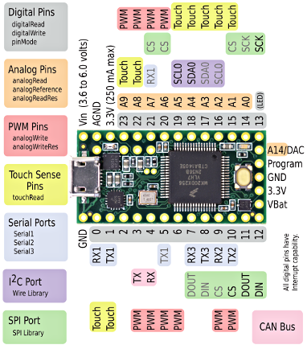
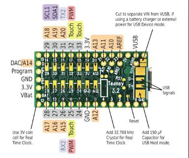

#### Documentation written by Cooper Richmond and Thomas Hulbert

-----

# Pins

| ***Motor Teensy***   |                 |                 |
| -------------------- | --------------- | --------------- |
| **Section**          | **Function**    | **Pin**         |
| **MOTOR 0**          | PWM 0           | 3               |
|                      | BRAKE 0         | 0               |
|                      | DIRECTION 0     | 6               |
|                      | CURRENT SENSE 0 | A9              |
| **MOTOR 1**          | PWM 1           | 4               |
|                      | BRAKE 1         | 1               |
|                      | DIRECTION 1     | 7               |
|                      | CURRENT SENSE 1 | A10             |
| **MOTOR 2**          | PWM 2           | 5               |
|                      | BRAKE 2         | 2               |
|                      | DIRECTION 2     | 8               |
|                      | CURRENT SENSE 2 | A11             |
| **MOTOR 3**          | PWM 3           | 21              |
|                      | BRAKE 3         | 20              |
|                      | DIRECTION 3     | 22              |
|                      | CURRENT SENSE 3 | *D.N.C.*        |
| **INDICATOR LEDS**   | LED 1           | 28              |
|                      | LED 2           | 27              |
|                      | LED 3           | 26              |
|                      | LED 4           | 25              |
| **SOLENOID**         | SOLENOID ENABLE | 9               |
| **LIGHT GATE**       | LIGHT GATE IN   | A12             |
| **BUZZER**           | BUZZER ENABLE   | A13             |
| **Tactile Button**   | Button 1        | 24              |
|                      | Button 2        | 33              |
| **I2C**              | *Not Connected* | *BUS* 0         |
|                      | SENSOR BUS      | *BUS* 1         |
| **SPI SLAVE SELECT** | LIGHT (SS)      | 15 / A0         |
|                      | TSOP (SS1)      | 16 / A1         |
|                      | PIXY (SS2)      | 17 / A2         |
|                      |                 |                 |
| ***TSOP Teensy***    |                 |                 |
| **Section**          | **Function**    | **Pin**         |
| **TSOPS**            | TSOP 0          | 1               |
|                      | TSOP 1          | 2               |
|                      | TSOP 2          | 3               |
|                      | TSOP 3          | 4               |
|                      | TSOP 4          | 5               |
|                      | TSOP 5          | 6               |
|                      | TSOP 6          | 7               |
|                      | TSOP 7          | 8               |
|                      | TSOP 8          | 9               |
|                      | TSOP 9          | 15              |
|                      | TSOP 10         | 16              |
|                      | TSOP 11         | 17              |
|                      | TSOP **POWER**  | 0               |
|                      | TSOP **POWER**  | 20              |
|                      | TSOP **POWER**  | 21              |
|                      | TSOP **POWER**  | 22              |
|                      | TSOP **POWER**  | 23              |
| **I2C**              | *Not Connected* |                 |
|                      | SENSOR BUS      | *BUS 1*         |
|                      |                 |                 |
| ***Light Teensy***   |                 |                 |
| **Section**          | **Function**    | **Pin**         |
| **LIGHT SENSORS**    | SENSOR 0        | A0              |
|                      | SENSOR 1        | A1              |
|                      | SENSOR 2        | A2              |
|                      | SENSOR 3        | A3              |
|                      | SENSOR 4        | A4              |
|                      | SENSOR 5        | A5              |
|                      | SENSOR 6        | A6              |
|                      | SENSOR 7        | A7              |
|                      | SENSOR 8        | A8              |
|                      | SENSOR 9        | A9              |
|                      | SENSOR 10       | A10             |
|                      | SENSOR 11       | A11             |
|                      | SENSOR 12       | A12             |
|                      | SENSOR 13       | A13             |
|                      | SENSOR 14       | A14             |
|                      | SENSOR 15       | A15             |
|                      | SENSOR 16       | A16             |
|                      | SENSOR 17       | A17             |
|                      | SENSOR 18       | A18             |
|                      |                 |                 |
| ***Sensors***        |                 |                 |
| **Section**          | **Function**    | **Address/Bus** |
| **Gyroscope**        |                 | *0x68/BUS 1*    |
| **SRF10**            | SRF10-1         | *0xE0/BUS 1*    |
|                      | SRF10-2         | *0xE0/BUS 1*    |
|                      | SRF10-3         | *0xE0/BUS 1*    |
|                      | SRF10-4         | *0xE0/BUS 1*    |